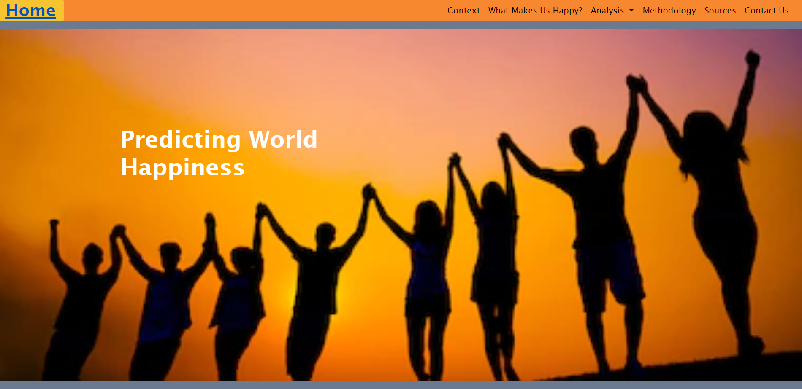
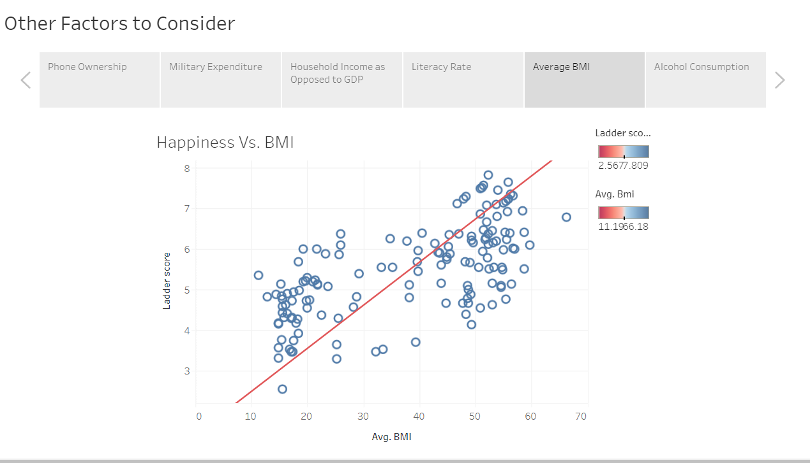
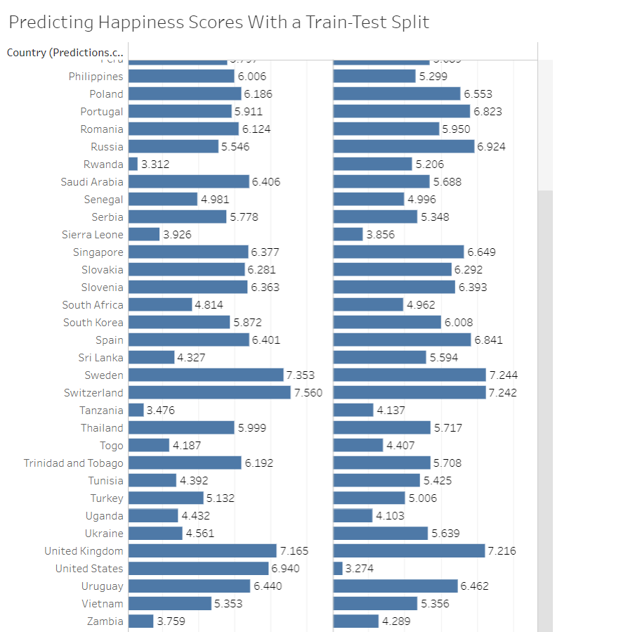

In this analysis of the World Happiness Report, we set out to answer three questions:

1. Which of the factors listed in the report is the most significant? The least significant?

2. What will global happiness look like in the future?

3. Are there any other significant factors of happiness that the report failed to consider?

First, we built a website to display the information we found:

Website URL: https://34krash.github.io/Final_Project/index.html

Then, we showed off our predictions over the next 5 years. We did not want to go further than 5 years because we only had data starting in 2015. We also included those we predicted would increase or decrease the most, as well as those we showed to have a high rate. 

The top 5 happy and least happy are based off our predictions from the current model, and then the biggest movers are those we are predicting to increase or decrease the most. 

Then, we checked the factors individually to see if they matched up with the happiness report and if there was a true correlation. 

We also came up with a few of our own factors we thought might have some significance and have a correlation with happiness:

Finally, because the Happiness report was not able to obtain every country for each year, we wanted to test if we could predict the happiness of countries based on these factors, so we ran a train-test split on the data. 

