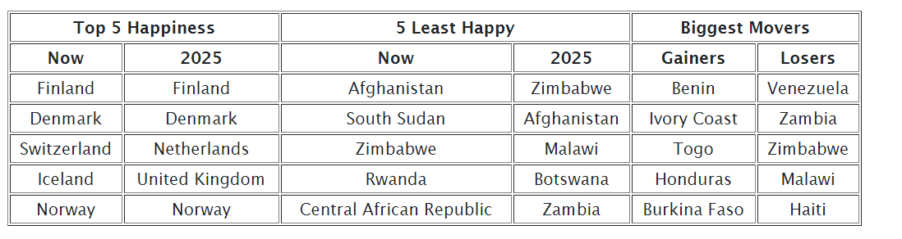
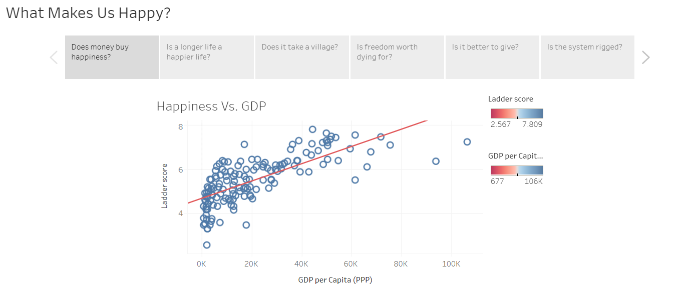

In this analysis of the World Happiness Report, we set out to answer three questions:

1. Which of the factors listed in the report is the most significant? The least significant?

2. What will global happiness look like in the future?

3. Are there any other significant factors of happiness that the report failed to consider?

The first thing we wanted to show on our website is our predictions as seen below: 

The top 5 happy and least happy are based off our predictions from the current model, and then the biggest movers are those we are predicting to increase or decrease the most. 

Then, we checked the factors individually to see if they matched up with the happiness report

